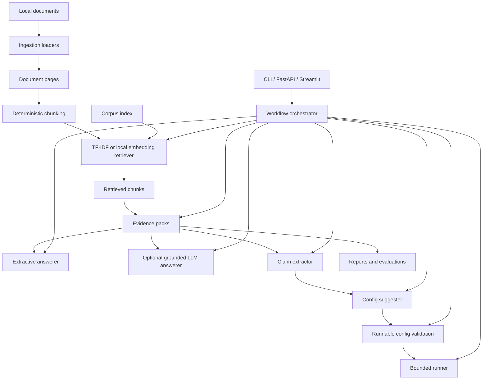

# Architecture

ResearchOps Agent is a local, citation-grounded research assistant for small paper and project
corpora. It ingests local documents, chunks them with source metadata, retrieves evidence,
answers from that evidence, extracts experiment-like claims, suggests bounded configs, and can
run a small explicitly supported forecasting experiment.

## Major Modules

- `ingestion`: loads `.txt`, `.md`, and `.pdf` files into page-level objects.
- `ingestion.chunking`: creates deterministic character chunks with overlap.
- `retrieval`: provides TF-IDF retrieval and optional local embedding retrieval.
- `retrieval.evidence`: converts retrieved chunks into citation-ready evidence packs.
- `agents.extractive`: answers by selecting evidence text without generation.
- `llm` and `agents.llm_grounded`: optional fake/OpenAI grounded answering with citation validation.
- `agents.claim_extractor`: extracts experiment-like claims with simple heuristics.
- `runner.config_builder`: suggests experiment configs from extracted claims.
- `runner`: validates and runs a bounded synthetic time-series forecasting task.
- `evaluation`: evaluates retrieval and answer behavior with deterministic fixtures.
- `corpus`: discovers documents, builds manifests, stores chunks, and searches an index.
- `workflows`: coordinates corpus search, evidence, answering, claims, configs, validation, runs,
  and workflow artifacts.
- `api` and `app/streamlit_app.py`: expose the local functionality through FastAPI and Streamlit.

## Data Flows

Single-document query:

1. Load one document.
2. Chunk pages.
3. Fit a local retriever on chunks.
4. Retrieve top chunks.
5. Build an evidence pack.
6. Answer extractively or with an optional grounded LLM.
7. Return citations tied to source chunks.

Corpus query:

1. Discover documents under a root folder.
2. Build and save a manifest, metadata, and chunks.
3. Re-fit the selected retriever from stored chunks at query time.
4. Retrieve across documents.
5. Answer or report from corpus evidence.

End-to-end workflow:

1. Search a persisted corpus index.
2. Build evidence.
3. Answer with citations.
4. Extract experiment-like claims.
5. Suggest an experiment config.
6. Validate whether the config is runnable.
7. Optionally run the bounded local runner.
8. Write JSON and Markdown workflow artifacts.

## Honesty Note

The system is a local MVP, not a general paper reproduction engine. It does not browse the web,
execute arbitrary code, or guarantee that heuristic claims or LLM prose are correct. The bounded
runner supports only a small explicit task family, and persisted indexes are intentionally simple.
